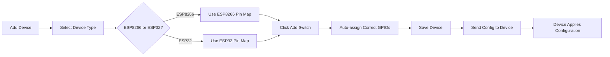

# ESP8266/ESP32 GPIO Pin Configuration

## 🎯 Overview
This document explains the correct GPIO pin mapping for ESP8266 and ESP32 devices when configuring new devices in the system.

## 📌 ESP8266 GPIO Pin Mapping

### **Relay Pins (Output)**
```cpp
const int relayPins[] = {4, 5, 12, 13};
```

| Switch # | GPIO Pin | NodeMCU Label | Description |
|----------|----------|---------------|-------------|
| Switch 1 | GPIO 4   | D2            | Safe for output |
| Switch 2 | GPIO 5   | D1            | Safe for output |
| Switch 3 | GPIO 12  | D6            | Safe for output |
| Switch 4 | GPIO 13  | D7            | Safe for output |

### **Manual Switch Pins (Input)**
```cpp
const int manualSwitchPins[] = {14, 16, 0, 2};
```

| Switch # | GPIO Pin | NodeMCU Label | Description | ⚠️ Warning |
|----------|----------|---------------|-------------|------------|
| Switch 1 | GPIO 14  | D5            | Safe for input | ✅ Safe |
| Switch 2 | GPIO 16  | D0            | Wake pin, safe | ✅ Safe |
| Switch 3 | GPIO 0   | D3            | **Boot mode** | ⚠️ Don't press during boot |
| Switch 4 | GPIO 2   | D4            | **Boot mode, LED** | ⚠️ Don't press during boot |

**Important Notes:**
- GPIO 0 and GPIO 2 affect boot mode
- They must be wired as **active-low with pull-ups**
- **Avoid pressing** these switches during ESP8266 reset or boot

## 📌 ESP32 GPIO Pin Mapping

### **Relay Pins (Output)**
```cpp
const int relayPins[] = {16, 17, 18, 19, 21, 22};
```

| Switch # | GPIO Pin | Description |
|----------|----------|-------------|
| Switch 1 | GPIO 16  | Safe for output |
| Switch 2 | GPIO 17  | Safe for output |
| Switch 3 | GPIO 18  | Safe for output |
| Switch 4 | GPIO 19  | Safe for output |
| Switch 5 | GPIO 21  | Safe for output |
| Switch 6 | GPIO 22  | Safe for output |

### **Manual Switch Pins (Input)**
```cpp
const int manualSwitchPins[] = {25, 26, 27, 32, 33, 23};
```

| Switch # | GPIO Pin | Description |
|----------|----------|-------------|
| Switch 1 | GPIO 25  | Safe for input |
| Switch 2 | GPIO 26  | Safe for input |
| Switch 3 | GPIO 27  | Safe for input |
| Switch 4 | GPIO 32  | Safe for input |
| Switch 5 | GPIO 33  | Safe for input |
| Switch 6 | GPIO 23  | Safe for input |

## 🔧 How It Works in the System

### **1. Device Creation - Auto GPIO Assignment**

When you click **"Add Switch"** in the device configuration dialog:

**For ESP8266:**
```javascript
Switch 1: Relay GPIO = 4,  Manual GPIO = 14
Switch 2: Relay GPIO = 5,  Manual GPIO = 16
Switch 3: Relay GPIO = 12, Manual GPIO = 0
Switch 4: Relay GPIO = 13, Manual GPIO = 2
```

**For ESP32:**
```javascript
Switch 1: Relay GPIO = 16, Manual GPIO = 25
Switch 2: Relay GPIO = 17, Manual GPIO = 26
Switch 3: Relay GPIO = 18, Manual GPIO = 27
Switch 4: Relay GPIO = 19, Manual GPIO = 32
Switch 5: Relay GPIO = 21, Manual GPIO = 33
Switch 6: Relay GPIO = 22, Manual GPIO = 23
```

### **2. Device Configuration Flow**



### **3. Backend Configuration**

When a device is created, the backend sends this configuration to the ESP device:

```json
{
  "mac": "6cc8404f82c0",
  "secret": "531f5e97...",
  "switches": [
    {
      "gpio": 4,
      "manualGpio": 14,
      "manualMode": "maintained"
    },
    {
      "gpio": 5,
      "manualGpio": 16,
      "manualMode": "maintained"
    }
  ]
}
```

The ESP device receives this via MQTT topic: `esp32/config`

## 📋 Configuration Files

### **ESP8266 Config** (`esp32/esp8266_config.h`)
```cpp
// Relay Configuration (ESP8266-safe GPIO pins)
const int relayPins[] = {4, 5, 12, 13};

// Manual Switch Configuration
// Note: GPIO0 and GPIO2 affect boot mode
const int manualSwitchPins[] = {14, 16, 0, 2};

// Number of switches
#define NUM_SWITCHES 4
```

### **Backend Config** (`backend/utils/gpioUtils.js`)
```javascript
// ESP8266 recommended pins (matches firmware config)
ESP8266_RECOMMENDED_PINS = {
  relay: {
    primary: [4, 5, 12, 13],    // Matches esp8266_config.h
    secondary: [14, 16]         // Alternative pins
  },
  manual: {
    primary: [14, 16, 0, 2],    // Matches esp8266_config.h
    secondary: [13, 1, 3]       // Alternative pins
  }
}
```

### **Frontend Config** (`src/components/DeviceConfigDialog.tsx`)
```typescript
// ESP8266 GPIO pin mapping (matches esp8266_config.h)
const esp8266RelayPins = [4, 5, 12, 13];
const esp8266ManualPins = [14, 16, 0, 2];

// ESP32 default GPIO pin mapping
const esp32RelayPins = [16, 17, 18, 19, 21, 22];
const esp32ManualPins = [25, 26, 27, 32, 33, 23];
```

## ⚙️ Manual Configuration Override

You can manually change GPIO pins in the device configuration:

1. Go to **Devices** page
2. Click **Edit** on a device
3. Expand a switch
4. Modify **Relay GPIO** and **Manual Switch GPIO**
5. Click **Save**

**⚠️ Warning:** Only use safe GPIO pins for your device type!

## 🔍 GPIO Pin Safety

### **ESP8266 Safe Pins**
✅ **Safe for Output:** 4, 5, 12, 13, 14, 15, 16
✅ **Safe for Input:** 4, 5, 12, 13, 14, 16
⚠️ **Use with Caution:** 0, 2 (boot mode pins)
❌ **Avoid:** 1 (TX), 3 (RX), 6-11 (flash), 15 (boot strapping)

### **ESP32 Safe Pins**
✅ **Safe for Output:** 16, 17, 18, 19, 21, 22, 23, 25, 26, 27, 32, 33
✅ **Safe for Input:** 34, 35, 36, 39 (input-only), 16-33
⚠️ **Use with Caution:** 0, 2 (boot mode pins)
❌ **Avoid:** 1 (TX), 3 (RX), 6-11 (flash)

## 🛠️ Troubleshooting

### **Problem: Device not responding after configuration**

**Check:**
1. Correct MAC address
2. Device type matches (ESP8266 vs ESP32)
3. GPIO pins are valid for the device type
4. No GPIO pin conflicts (same pin used twice)

### **Problem: Manual switches not working**

**Check:**
1. Manual switch is **enabled** in config
2. Manual GPIO is **not the same** as relay GPIO
3. Wiring is correct (active-low or active-high)
4. For ESP8266 GPIO 0/2: Don't press during boot

### **Problem: Relays triggering on boot**

**Solution:**
- Use pull-up/pull-down resistors
- Choose pins that default to safe state
- For ESP8266: Avoid GPIO 15 (always HIGH on boot)

## 📊 Quick Reference Table

| Device Type | Max Switches | Relay Pins | Manual Pins | Safe for PIR |
|-------------|--------------|------------|-------------|--------------|
| **ESP8266** | 4 | 4,5,12,13 | 14,16,0,2 | 4,5,12,13,14,16 |
| **ESP32** | 6 | 16-22 | 25-33,23 | 34,35,36,39,32-33 |

## ✅ Best Practices

1. **Always select correct device type** before adding switches
2. **Use default pin assignments** unless you have a specific reason to change
3. **Test configuration** before deploying to production
4. **Document custom pin mappings** if you modify defaults
5. **Avoid boot-critical pins** (GPIO 0, 2, 15 on ESP8266)
6. **Use input-only pins for PIR** on ESP32 (34, 35, 36, 39)

## 🚀 Quick Start

### **Adding a New ESP8266 Device**

1. Click **Add Device**
2. Enter device name and MAC address
3. Select **Device Type: ESP8266**
4. Click **Add Switch** (repeat up to 4 times)
5. Pins auto-assigned:
   - Switch 1: GPIO 4 (relay), GPIO 14 (manual)
   - Switch 2: GPIO 5 (relay), GPIO 16 (manual)
   - Switch 3: GPIO 12 (relay), GPIO 0 (manual)
   - Switch 4: GPIO 13 (relay), GPIO 2 (manual)
6. Click **Save**
7. Device will receive configuration via MQTT

### **Adding a New ESP32 Device**

1. Click **Add Device**
2. Enter device name and MAC address
3. Select **Device Type: ESP32**
4. Click **Add Switch** (repeat up to 6 times)
5. Pins auto-assigned starting from GPIO 16/25
6. Click **Save**

---

**Date Updated:** October 9, 2025  
**Configuration Source:** `esp32/esp8266_config.h`  
**Frontend Implementation:** `src/components/DeviceConfigDialog.tsx`  
**Backend Handler:** `backend/server.js` (MQTT config publish)
